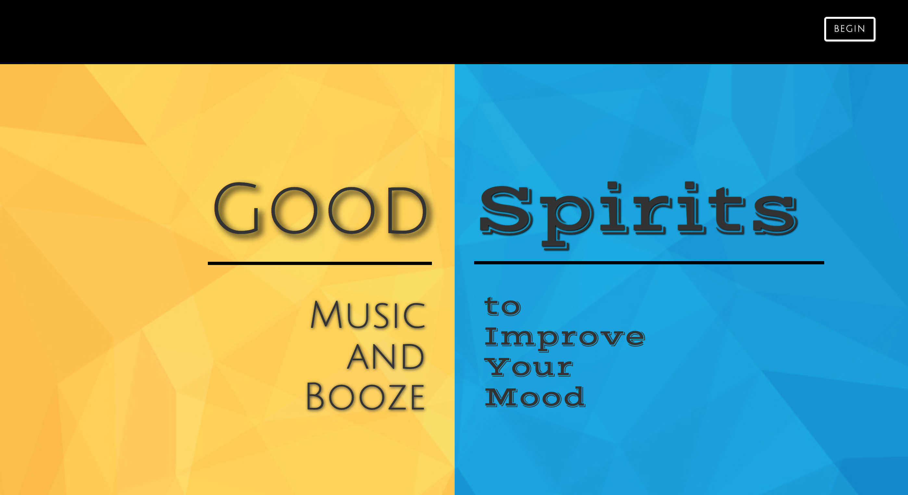
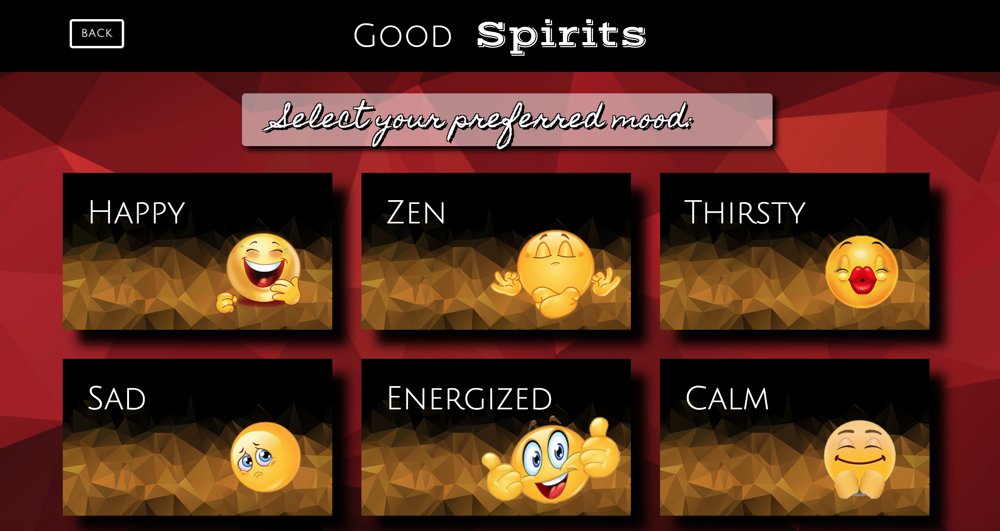

# Good Spirits

## Description 

We decided to design this app to help the adult community relax during this quarantine period. Indeed, we all know that every human being has never been called to live alone, isolated or even locked in the house. During this pandemic and social distancing, we had noticed that people find themselves in different moods, depending on how they wake up in the morning, so we decided to create this app called "GOOD SPIRITS".

"GOOD SPIRITS" is an app that will help you change or keep your mood right every day. All you have to do is enter your mood and the app will return you a playlist as well as a cocktail to help you improve your mood.

We created this app using all the concepts we learned in school starting with HTML, CSS, the basic concepts of JAVASCRIPT through the manipulation of the DOM, and the principles of JQUERY. We had access to two APIs (Deezer and CocktailDB) to create the website.  

## Installation

1. Clone the repository from GitHub.
2. Open the index.html file in a default browser.

## Usage 

Using "GOOD SPIRITS" is easy and simple. As soon as you open the app, you'll be on the home page. On the right corner of your screen, you will find a button where it says Begin. 
As soon as you click there, you will be led to a page to confirm that you are at least 21 years old, given that the law requires us to be 21 years old before consuming an alcoholic beverages.

After confirming this, you will be led to the page that contains the different moods among which could carry your choice. After choosing your mood, you can then choose your kind of music and then you will be offered a playlist, combined with a cocktail, to allow you to change or keep your mood. Simple.

To access Good Spirits
[CLICK HERE](https://elizaregas.github.io/Good-Spirits/)

## Credits

This app was designed and built by Joel Bell, Andrew Taylor Collier, Jimmy Kazadi, and Eliza Regas. 

## MIT License

Copyright (c) [2020] [Eliza Regas]

Permission is hereby granted, free of charge, to any person obtaining a copy
of this software and associated documentation files (the "Software"), to deal
in the Software without restriction, including without limitation the rights
to use, copy, modify, merge, publish, distribute, sublicense, and/or sell
copies of the Software, and to permit persons to whom the Software is
furnished to do so, subject to the following conditions:

The above copyright notice and this permission notice shall be included in all
copies or substantial portions of the Software.

THE SOFTWARE IS PROVIDED "AS IS", WITHOUT WARRANTY OF ANY KIND, EXPRESS OR
IMPLIED, INCLUDING BUT NOT LIMITED TO THE WARRANTIES OF MERCHANTABILITY,
FITNESS FOR A PARTICULAR PURPOSE AND NONINFRINGEMENT. IN NO EVENT SHALL THE
AUTHORS OR COPYRIGHT HOLDERS BE LIABLE FOR ANY CLAIM, DAMAGES OR OTHER
LIABILITY, WHETHER IN AN ACTION OF CONTRACT, TORT OR OTHERWISE, ARISING FROM,
OUT OF OR IN CONNECTION WITH THE SOFTWARE OR THE USE OR OTHER DEALINGS IN THE
SOFTWARE.

